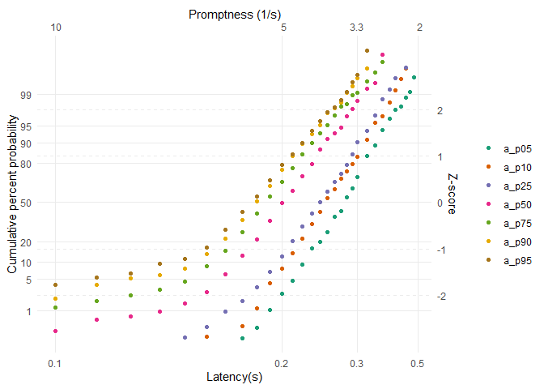
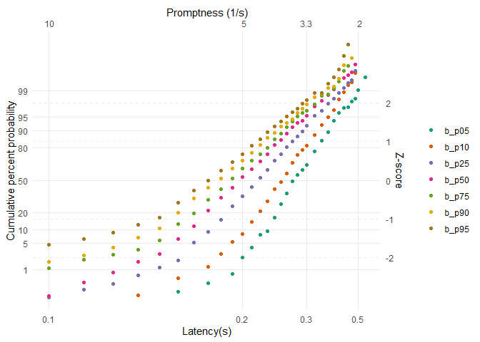

<!-- README.md is generated from README.Rmd. Please edit that file -->

# LATERmodel

<!-- badges: start -->
<!-- badges: end -->

The goal of LATERmodel is to make the

## Installation

You can install the development version of LATERmodel from
[GitHub](https://github.com/) with:

``` r
# install.packages("devtools")
devtools::install_github("unimelbmdap/LATERmodel")
```

## Example

Load digitised data from Figure 1 in Carpenter and Williams (1995)

``` r
library(LATERmodel)

data(carpenter_williams_1995)
```

Figure 1a

``` r
a <- prepare_data(dplyr::filter(carpenter_williams_1995, participant == "a"))
reciprobit_plot(a)
```



Figure 1b

``` r
b <- prepare_data(dplyr::filter(carpenter_williams_1995, participant == "b"))
reciprobit_plot(b)
```


