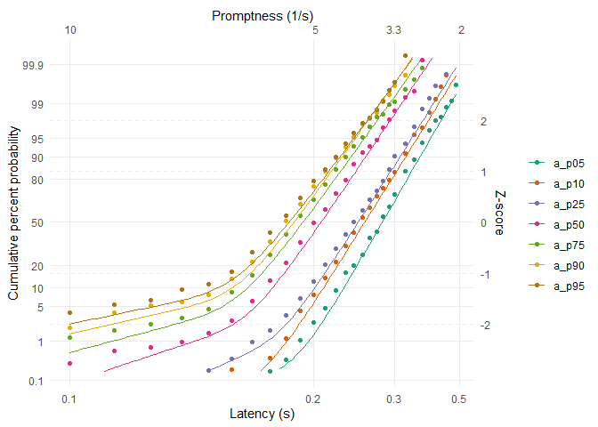

<!-- README.md is generated from README.Rmd. Please edit that file -->

# LATERmodel

<!-- badges: start -->

[](https://github.com/unimelbmdap/LATERmodel/actions/workflows/R-CMD-check.yaml)
<!-- badges: end -->

The LATERmodel R package is an open-source implementation of Roger
Carpenter’s Linear Approach to Threshold with Ergodic Rate (LATER) model
(R. Carpenter (1981), Noorani and Carpenter (2016)). This package
enables the easy visualisation of reaction time data in LATER’s
signature reciprobit space, as well as estimating parameters to fit the
model to datasets, comparing raw datasets, comparing fits (i.e., is the
dataset better explained by a shift or a swivel?), adding an early
component, etc.

This package also includes two canonical datasets digitised from R. H.
S. Carpenter and Williams (1995) and Reddi, Asrress, and Carpenter
(2003).

## Installation

You can install LATERmodel with:

``` r
install.packages("LATERmodel")
```

## Example

Load digitised data from Figure 1 in Carpenter and Williams (1995):

``` r
library(LATERmodel)

data(carpenter_williams_1995)
```

Extract data corresponding only to participant `a` (Figure 1.a):

``` r
raw_data <- subset(carpenter_williams_1995, participant == "a")
```

The data analysis functions within this package require the raw data to
first undergo pre-processing using the `prepare_data` function. We pass
our `raw_data` variable as the argument to the `raw_data` parameter of
`prepare_data` to perform such pre-processing:

``` r
data <- prepare_data(raw_data = raw_data)
```

Fit each condition individually (no shared parameters between them), and
include an early component for all of them:

``` r
data_fit <- individual_later_fit(data, with_early_component = TRUE)
```

Visualise the raw data and the best individual fits:

``` r
reciprobit_plot(data, data_fit)
```



For a more detailed analysis using the `LATERmodel` R package, see [this
article](https://unimelbmdap.github.io/LATERmodel/articles/cw1995_analysis.html).

<div id="refs" class="references csl-bib-body hanging-indent">

<div id="ref-carpenter_neural_1995" class="csl-entry">

Carpenter, R. H. S., and M. L. L. Williams. 1995. “Neural Computation of
Log Likelihood in Control of Saccadic Eye Movements.” *Nature* 377
(6544): 59–62. <https://doi.org/10.1038/377059a0>.

</div>

<div id="ref-carpenter_eye_1981" class="csl-entry">

Carpenter, RHS. 1981. “Eye Movements: Cognition and Visual Perception.”
*Oculomotor Procrastination (Fisher DF, Monty RA, Senders JW, Eds) Pp*
237: 246.

</div>

<div id="ref-noorani_later_2016" class="csl-entry">

Noorani, Imran, and R. H. S. Carpenter. 2016. “The LATER Model of
Reaction Time and Decision.” *Neuroscience & Biobehavioral Reviews* 64
(May): 229–51. <https://doi.org/10.1016/j.neubiorev.2016.02.018>.

</div>

<div id="ref-reddi_accuracy_2003" class="csl-entry">

Reddi, B. a. J., K. N. Asrress, and R. H. S. Carpenter. 2003. “Accuracy,
Information, and Response Time in a Saccadic Decision Task.” *Journal of
Neurophysiology* 90 (5): 3538–46.
<https://doi.org/10.1152/jn.00689.2002>.

</div>

</div>
