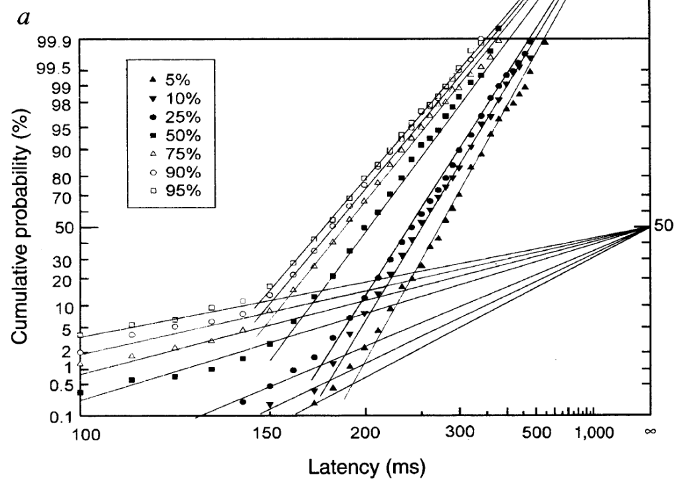

<!--
to build:
devtools::build_rmd("vignettes/articles/cw1995_analysis.Rmd")
-->

```{r, include = FALSE}
knitr::opts_chunk$set(
  collapse = TRUE,
  comment = "#>"
)
```

```{r echo = FALSE, results = "hide", message = FALSE}
library(printr)
```

Here, we will walk through the analysis of some example data from the article "Neural computation of log likelihood in control of saccadic eye movements" by @Carpenter1995.
We will be particularly interested in analysing the data from participant *a*, as shown in the figure below (their Figure 2a).

```{r echo = FALSE, fig.align = "center", out.width = "75%"}

```

We start by loading the LATERmodel package:

```{r setup, echo = TRUE, results = "hide", message = FALSE}
library(LATERmodel)
```

## Loading the raw data

A digitised version of the raw data from this study is included in this package in the `LATERmodel::carpenter_williams_1995` variable.
This variable is a data frame with rows corresponding to trials and with columns named `participant`, `condition`, and `time`.
This is the recommended format for raw data to be used with the LATERmodel package.
The `participant` and `condition` columns specify the identifiers for the participant and condition, respectively, and the `time` column specifies the measured response time (in milliseconds).
The rows corresponding to a particular unique combination of `participant` and `condition` are referred to as a *dataset* within this package.

We can look at the first few rows, using the `head` function, to see the structure of the variable:
```{r}
head(LATERmodel::carpenter_williams_1995)
```

Because `LATERmodel::carpenter_williams_1995` contains trials for both participants *a* and *b* but we are only interested in participant *a* here, we will extract only the trials for participant *a* from this variable using the `subset` function:
```{r}
raw_data <- subset(x = LATERmodel::carpenter_williams_1995, participant == "a")
```


## Pre-processing the data

The data analysis functions within this `LATERmodel` package require the raw data to first undergo pre-processing using the `LATERmodel::prepare_data` function.
We pass our `raw_data` variable as the argument to the `rt` parameter of `LATERmodel::prepare_data` to perform such pre-processing:

```{r}
data <- LATERmodel::prepare_data(rt = raw_data)
```

Note that if the raw data had response times in units other than milliseconds, we could have used the `time_unit` parameter to `LATERmodel::prepare_data` to specify the units (see the documentation for `LATERmodel::prepare_data` for details).

We can again view the first few rows to inspect the output of the pre-processing:

```{r}
head(data)
```

As shown above, the data now has columns for `name` (formed from the combination of the `participant` and `condition` columns in the raw data), `promptness` (the inverse of the `time` column, which is now specified in seconds), and `e_cdf` (the evaluated empirical cumulative distribution function for each dataset).

To make the condition names match those used in @Carpenter1995, we can recode them:

```{r}
# make the names match C&W
data$name <- dplyr::recode_factor(
  .x = data$name,
  a_p05 = "5%",
  a_p10 = "10%",
  a_p25 = "25%",
  a_p50 = "50%",
  a_p75 = "75%",
  a_p90 = "90%",
  a_p95 = "95%"
)
```

## Visualising the observed data

We can use the `LATERmodel::reciprobit_plot` function to visualise the observed data in 'reciprobit' space:

```{r message = FALSE, warning = FALSE}
LATERmodel::reciprobit_plot(plot_data = data)
```

This produces a plot in which the empirical cumulative distribution function values for each of the datasets in `data` are shown as individual points, with points from different datasets shown in different colours (the colours can be set to user-specified values using the `LATERmodel::prepare_data` function referred to earlier, if desired).
The lower horizontal axis shows the response time latency, in seconds, increasing positively but non-linearly to the right.
The upper horizontal axis shows the reciprocal of the response time latency, which is the *promptness*, decreasing linearly.
The left vertical axis shows the cumulative probability with non-linear (probit) spacing, and the right vertical axis shows this with linear spacing (*z*-scores).

We can use parameters of the `LATERmodel::reciprobit_plot` function to increase the similarity of the plot structure with the visualisation in @Carpenter1995.
In particular, we can specify the specific y-axis breakpoints using the `probit_breaks` parameter (specified in percentages) and the specific x-axis breakpoints using the `time_breaks` parameter (specified in seconds).
Furthermore, we can apply our own specific customisations by using functions from the `ggplot2` visualisation package.
Here, we will use such functionality to set the axis limits (where the x-axis is specified in promptness units and the y-axis is specified in probability units) and allow data points to be visible beyond the axis limits.
Note that such customisations are just to be able to more closely match the appearance of the @Carpenter1995 figure and are not generally required.

```{r fig.show='hold', out.width = c("50%", "50%"), message = FALSE, warning = FALSE}

# show the C&W figure in this document
plot <- LATERmodel::reciprobit_plot(
  plot_data = data,
  probit_breaks = c(
    0.1, 0.5, 1, 2, 5, 10, 20, 30, 50, 70, 80, 90, 95, 98, 99, 99.5, 99.9
  ),
  time_breaks = c(0.1, 0.15, 0.2, 0.3, 0.5, 1.0)
)
plot + ggplot2::coord_cartesian(
  xlim = c(10, 0.5),
  ylim = c(0.001, 0.999),
  expand = FALSE,
  clip = "off"
)
```

## Fitting the observed data

### Single dataset

We will first consider how we can fit a LATER model to the observations from a single dataset: the 5% condition.
First, because `data` contains trials from all the conditions for participant *a*, we will extract only the relevant data:

```{r}
data_p05 <- subset(x = data, name == "5%")
```

We can use the `LATERmodel::fit_data` function to perform the fitting.
When fitting a single dataset, the most important decision to make is whether the model should include an *early* component, corresponding to very fast responses.
The inclusion of this model component is controlled by the `with_early_component` parameter to `LATERmodel::fit_data`, and defaults to `FALSE`.
Here, we will fit the data including an early component.

```{r}
fit_p05 <- LATERmodel::fit_data(
  data = data_p05,
  with_early_component = TRUE
)
```

The returned variable, here named `fit_p05`, contains information about the fitting parameters and the fitting result.
The best-fitting parameter values can be accessed in the `named_fit_params` variable:

```{r}
fit_p05$named_fit_params
```

To be able to interpret these model parameters, we will briefly consider the components of a LATER model (see @Carpenter2023 for detailed information on the LATER model).
The key assumption of a LATER model is that the inverse of response time (promptness) can be modeled as a Normal distribution.
This distribution can either be parameterised via location ($\mu$) and scale ($\sigma$) parameters or via intercept ($k$) and scale ($\sigma$) parameters; we refer to the latter parameterisation as the 'intercept form' (so named because the $k$ parameter describes the point in *z*-score space where the response time latency approaches infinity), and the need for these two different parameterisations will become clearer in the "Multiple datasets fitted together" section below.
Because of the ambiguity around whether the Normal distribution is parameterised as $\left(\mu, \sigma\right)$ or $\left(k, \sigma\right)$, we refer to the Normal distribution as having the parameters $\left(a, \sigma\right)$ and allow $a$ can take on either $\mu$ or $k$ depending on the desired parameterisation.
The best-fitting values of $a$ and $\sigma$ for this dataset are shown in the table above ($s$, also present in the table, is simply $1 / \sigma$).
The table also shows the best-fitting $\mu$ value, which is identical to the value reported for $a$ - this indicates that the Normal distribution was fit with the parameterisation where $a = \mu$ (this is the default in `LATERmodel::fit_data`).
Because the location and intercept parameters are related via $\mu = k \sigma$ and $k = \mu / \sigma$, we also report the value for $k$ in the table above.

As mentioned previously, a LATER model can also include an *early* component in addition to the primary component described above.
This early component is also assumed to be Normally distributed in promptness space, but with a fixed value of $\mu$ (and $k$) of zero.
The scale parameter of this component is labelled $\sigma_e$.
According to the LATER model, these early and primary components compete to produce the response time on a given trial - whichever has the highest promptness (lowest response time) is responsible for producing the response time.
Because the early component has its location parameter set to a low value (0) in promptness space, it will be more likely to generate a lower value than the primary component.
However, by having relatively high value of $\sigma_e$, it has the capacity to occasionally produce high values of promptness; as such, it is able to describe unusually fast response times.
The best-fitting value of $\sigma_e$ is also reported in the table above.

To visually assess the reasonableness of the fitted parameters, we can visualise the fit by passing the variable containing the parameters to the `LATERmodel::reciprobit_plot` function:

```{r message = FALSE, warning = FALSE}
LATERmodel::reciprobit_plot(
  plot_data = data_p05,
  fit_params = fit_p05$named_fit_params
)
```

### Multiple datasets fitted separately

If we want to fit multiple datasets but consider each dataset separately in the fitting, we can use the `LATERmodel::individual_later_fit` helper function.
Here, we will use it to fit all the conditions in the example data:

```{r}
individual_named_fit_params <- LATERmodel::individual_later_fit(
  df = data,
  with_early_component = TRUE
)
```

This function directly returns the `named_fit_params` component of the fit information:

```{r}
individual_named_fit_params
```

We can plot the result, as before.
To facilitate comparison with @Carpenter1995, we will again add some custom parameters and modifications to the layout of the figure:

```{r fig.show='hold', out.width = c("50%", "50%"), message = FALSE, warning = FALSE}

plot <- LATERmodel::reciprobit_plot(
  plot_data = data,
  fit_params = individual_named_fit_params,
  probit_breaks = c(
    0.1, 0.5, 1, 2, 5, 10, 20, 30, 50, 70, 80, 90, 95, 98, 99, 99.5, 99.9
  ),
  time_breaks = c(0.1, 0.15, 0.2, 0.3, 0.5, 1.0)
)
plot + ggplot2::coord_cartesian(
  xlim = c(10, 0.5),
  ylim = c(0.001, 0.999),
  expand = FALSE,
  clip = "off"
)
```

Note that, in contrast to @Carpenter1995, our plots show the fits from the complete model rather than attempting to isolate the early and primary components.
In the following explanation from @Carpenter2023, p. 26, about these different plotting approaches, the approach in this package corresponds to the 'alternative' that they describe (and their 'main' and 'maverick' components correspond to our 'primary' and 'early' components):

> "it is important to point out that although for clarity it can often be helpful to plot the asymptotes – in effect, the two separate components corresponding to the main and maverick components – the data points will not be expected to go through them: an alternative is to plot the combined theoretical distribution resulting from both components together"

### Multiple datasets fitted together

We might be interested in situations in which multiple datasets have the same LATER model parameter value.
We refer to such a scenario as a *sharing* of model parameters.

#### A 'shift' sharing arrangement

For example, multiple datasets might be considered to have the same scale of the primary component ($\sigma$) but vary in the location of the primary component ($\mu$) and the scale of the early component ($\sigma_e$).
This particular arrangement is known as a *shift*.

To fit the datasets under such a sharing constraint, we use the parameters to the `LATERmodel::fit_data` function that begin with `share_`.
To implement the example above, we would set `share_sigma = TRUE`:

```{r}
fit_shift <- LATERmodel::fit_data(
  data = data,
  with_early_component = TRUE,
  share_sigma = TRUE
)
```

When we look at the fitted parameter values, we can see that they each have the same `sigma` (and $s$, which is just $1 / \sigma$) - as expected by our request that the $\sigma$ parameter be shared across datasets:

```{r}
fit_shift$named_fit_params
```

We can once again visualise the fits:

```{r message = FALSE, warning = FALSE}
LATERmodel::reciprobit_plot(
  plot_data = data,
  fit_params = fit_shift$named_fit_params
)
```

#### A 'swivel' sharing arrangement

We can also consider other sharing arrangements.
A particularly useful arrangement is known as a *swivel*, and occurs when multiple datasets share the *intercept* parameter ($k$) in the model.
As described in the previous explanation of the model parameters (when fitting a single dataset), the intercept captures the point in z-score space where the response time latency approaches infinity.
When sharing the intercept, multiple datasets have the flexibility to rotate or 'swivel' around this intercept point.

To be able to share the intercept, we need to tell `LATERmodel::fit_data` that we would like the $a$ parameter in the model to refer to $k$ rather than $\mu$.
We do that by setting the `intercept_form` parameter to `LATERmodel::fit_data` to `TRUE`.
We also indicate that we would like this parameter to be shared by setting the `share_a` parameter to `LATERmodel::fit_data` to `TRUE`.

```{r}
fit_swivel <- LATERmodel::fit_data(
  data = data,
  with_early_component = TRUE,
  intercept_form = TRUE,
  share_a = TRUE
)
```

Again, we can inspect the fitted parameters:

```{r}
fit_swivel$named_fit_params
```

We can also again plot the fits.
Note how the fits are constrained such that they would each meet at a common point on the vertical axis if extrapolated to an infinite latency - this is the consequence of sharing the intercept parameter in the model.

```{r message = FALSE, warning = FALSE}
LATERmodel::reciprobit_plot(
  plot_data = data,
  fit_params = fit_swivel$named_fit_params
)
```

#### Comparing 'shift' and 'swivel' fits

We have seen how we can implement different sharing arrangements when fitting multiple datasets.
To quantify and compare how well the different sharing arrangements fit the data, we can use the `LATERmodel::compare_fits` function.
This function accepts a named list of variables returned from `LATERmodel::fit_data`, so we will first construct this variable using the fits for 'shift' and 'swivel':

```{r}
fits <- list(shift = fit_shift, swivel = fit_swivel)
```

We then pass this variable as the argument to the `fits` parameter in the `LATERmodel::compare_fits` function:

```{r}
LATERmodel::compare_fits(fits = fits)
```

The output from this function contains a row for each of the provided fit results, ordered such that the first row contains the 'best' ('preferred') fit.
This assessment of which fit is 'best' is based on the relative Akaike Information Criterion (AIC) values for the fits, where lower AIC values are interpreted as indicating a superior fit in comparison to higher AIC values.
The `aic` column in the table reports these AIC values, and the `preferred_rel_fit_delta_aic` reports the difference in AIC values between the preferred fit and the AIC value for the fit in the relevant row.
In this example, the 'shift' fit is the preferred fit (also indicated in the `preferred` column) as the 'swivel' fit has an AIC that is 462.2301 units lower than the AIC for the 'shift' fit.
Finally, this comparison is also reported as an 'evidence ratio' in the `preferred_rel_fit_evidence_ratio` column.
As described in @Motulsky2004, this evidence ratio "tells you the relative likelihood, given your experimental design, of the two models being correct" (p. 147).
Here, the evidence ratio reported in the 'swivel' row is overwhelmingly high, which indicates that the preferred fit (the 'shift') is much more likely to be the 'correct' fit than the 'swivel' (noting that the evidence ratio is calculated as the ratio of the preferred fit to the fit reported in the row).


## Summary

In this walkthrough, we have seen how we can use this package to conduct an analysis of response time data using the LATER model.
First, we represented the raw data as a data table having columns for `name`, `condition`, and `time` and having rows corresponding to single trials.
We then used the `LATERmodel::prepare_data` function to convert this raw data into a format suitable for subsequent analysis.
We used the `LATERmodel::fit_data` function to fit the parameters of a LATER model to such data; either for a single dataset, multiple datasets considered separately, or multiple datasets with sharing of LATER model parameters.
We saw how we could use the `LATERmodel::reciprobit_plot` to visualise both the observed data and model fits in the 'reciprobit' space used in the LATER model.
Finally, we used the `LATERmodel::compare_fits` function to compare the goodness-of-fit of multiple fits to data.


## References
