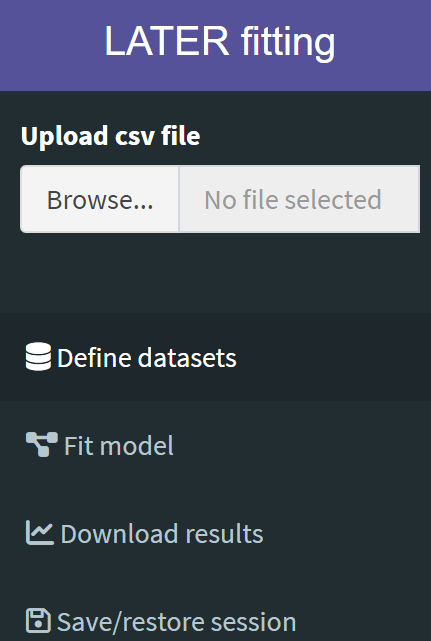

```{r, include = FALSE}
knitr::opts_chunk$set(
  collapse = TRUE,
  comment = "#>"
)
```

The [LATER fitting](http://172.26.131.77:3838/) R Shiny application (“the app”), 
is designed to provide a simple way to use 
[LATERmodel](https://github.com/unimelbmdap/LATERmodel/) to fit the LATER model 
to reaction time data. 

On loading, the app displays a sidebar on the left with a widget to upload your 
data, followed by four tabs:

```{r echo = FALSE}

```

* **Define datasets** is used to subset the uploaded dataset by participant and 
conditions, allowing the user to create a named "dataset" for each, to use the 
app’s fitting and plotting procedures.
*	**Fit model** is used to fit your datasets with the LATER model.
*	**Download results** is used to customise various aspects of the LATER plot 
(e.g. axis labels, range, and figure size), and to download the figure in 
various formats, in addition to the raw data that was used to generate the 
figure.
*	**Save/restore session** can be used to save the state of the app at any time, 
which will download a file to your local computer. This file can subsequently 
be uploaded to the app from the same tab to resume your analysis where you left 
it.

In general, fitting your reaction time data involves working through the tabs 
in succession.

# Loading in Data, and Creating a Named Dataset From These Data
## Loading in Data
Reaction time data can be loaded by clicking the “Browse…” button under 
“Upload cvs file” in the left sidebar and navigating to the file you wish to 
upload from your local computer. Data needs to be in a comma-separated values 
(.csv) file. The following random sample of 10 rows taken from the sample data 
file `carpenter_williams_1995` (provided with the LATERmodel package), 
demonstrates this format:

```{r}
dplyr::sample_n(LATERmodel::carpenter_williams_1995, 10)
```

In this data file, *participant* gives a unique identifier for each participant 
tested, *condition* gives the label for the particular experiment performed by 
the participant, and *time* gives the reaction time in milliseconds. For 
example, in `carpenter_williams_1995`, two participants have been 
labelled “a” and “b”, and they each performed seven experiments in which the 
probability of the target appearing on a particular side changed 
(labelled “p05”, “p10”, “p25”, “p50”, “p75”, “p90” and “p95” in the complete file).
Data files can also include an optional column labelled “color”, that will 
determine the colour of the plot. Colours can be listed as names accepted by 
R (e.g. “darkgray”) or can be hexadecimal colour codes.

You can see the complete list of color names accepted by R using the built-in 
`colors` function (here we show only the first 20): 
```{r}
head(colors(), 20)
```

## Creating a Named Dataset From These Data

Once loaded, a Dataset can be created, which are subsets of the loaded data 
that can then be fitted and plotted. To create a Dataset:

1. Click the *Participant* drop-down menu and select the participant you wish to 
include. Note that only one participant can be selected at a time.
2. Click the *Conditions* drop down menu to select the condition to be included 
in the Dataset. If multiple conditions are selected in succession, these will be 
merged into the single named Dataset.
3.	Give the Dataset a unique name in the *Dataset Name* field.
4.	Click *Add dataset*.

Each new Dataset is appended to the table of “Created datasets” on the right of 
the screen, and the raw data is plotted in the figure. Datasets can be 
removed by clicking the “Remove” button on the corresponding row of the table.

# Fitting the LATER Model to a Dataset
On the “Fit model” tab, click on the “Datasets to fit” field, and successively 
select the Dataset(s) you wish to fit. There are several fitting options 
available:

* **Model components**
    + *Use intercept form*: select this option if you wish to constrain fits to 
    have a common intercept ($k$) at infinite time on a reciprobit plot (the most 
    common interpretation of a “swivel”). Note that the intercept $k$ is equal to 
    $\frac{\mu}{\sigma}$.
    + *Fit with early component*: select this option if you wish your fit to 
    include a parameter $\sigma_{e}$ that quantifies a tail of early responses 
    in your reaction times.
* **Fitting methods** 
    + *Fitting criterion* allows you to select whether you would like to 
    perform a maximum likelihood fit (recommended) or a fit that minimises the 
    Kolmogorov-Smirnov (KS) statistic. 
    + When fitting multiple Datasets using shared parameters, the *Use minmax* 
    option will optimise the fit for the worse fitted dataset in the collection 
    of Datasets.
*	**Shared parameters**: these options determine which parameters, if any, will 
have a common value between the Datasets to be fit. Note that, if you have 
selected multiple Datasets, you must have at least one shared parameter for the 
fit to proceed.

Once suitable options have been selected, provide a unique name for the fit in 
the *Fit Name* field, and perform the fit by clicking the *Fit datasets* button.

Upon fitting, the fit parameters will be appended to a table of fits in the 
right of the screen, along with the fitting criterion (“ks” or “likelihood”), 
the value of the fit criterion, the fit's negative log-likelihood (natural log), 
and the Akaike Information Criterion (“aic”).

Fits are also visualised in the plot, with a drop-down menu to select which fit 
you would like to visualise.

Example fits would be:

*	**Swivel about infinite time**: select *Use intercept form* and 
$k = \frac{\mu}{\sigma}$" from the list of shared parameters. *Fit with early 
component* (and, if selected, the option to share $\sigma_{e}$) is optional.
*	**Shift**: a fit where $\mu$ differs between Datasets, but $\sigma$ is common: 
leave *Use intercept form* unchecked, and under *Shared parameters* select 
$\sigma$. As above, options for early components are optional.
*	**Swivel about a cumulative probability of 50%**: corresponding to an alteration 
in $\sigma$ alone between datasets. Leave *Use intercept form* unchecked, and 
under *Shared parameters* select $\mu$. As above, options for early components 
are optional.

# Customising a plot
On the **Download results** tab, use the *Name of fit* drop-down menu to select 
the fit you wish to visualise and customise. Options include:

*	*Time unit*: latencies are expressed as milliseconds, deciseconds, or seconds.
*	*Label for x-axis*: the x-axis can be labelled either “Latency” or “Reaction time”.
*	*Time range (ms)*: the range of values on the x axis, in milliseconds, to be visualised.
*	*Probability range*: the range of values on the y axis to be visualised.
*	*Reciprobit axes*: By default, figures are plotted with Promptness on the 
x-axis, and Z-score on the y-axis. Selecting this option will also include 
latency and cumulative percent probability as secondary axis ticks and labels, 
as used in traditional reciprobit plots.
*	*Plot dimensions* (*width*, *height*, *units*): the dimensions of the plot, 
and what units these dimensions are in.
*	*Figure format*: which format you wish to download the figure as.

Once you are happy with your figure customisation, it (along with the data and 
fits used to generate such figure) can be downloaded by clicking the 
*Download* button.

# Saving or restoring a session
If you would like to continue your work at another time or on a different 
computer, or share your work with someone else who would like to replicate your 
analysis, you can save your progress using the button *Save state of app*. 

This will download a file with an `.rds` extension, which you will need to 
upload to the shiny app when you are ready to continue your analysis work.
